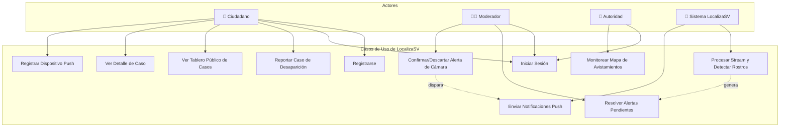
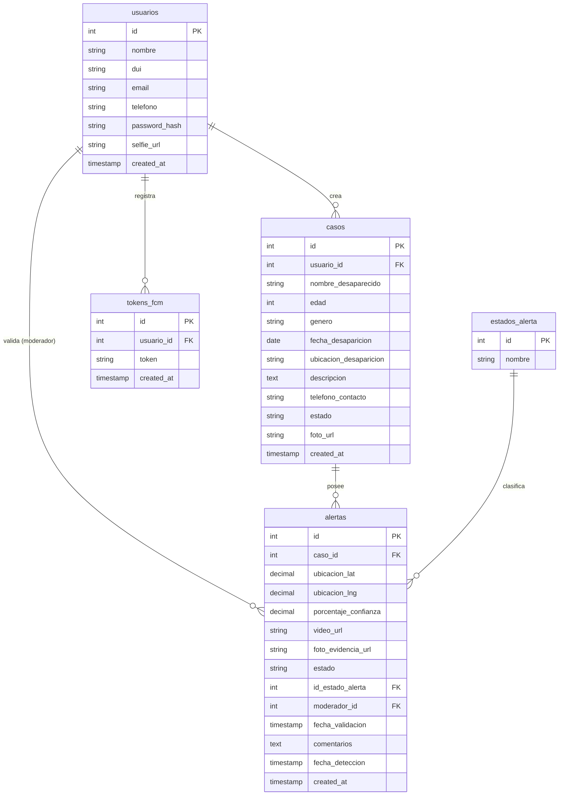

 # LocalizaSV - Prototipos Figma y Diagramas del Sistema

Este documento recopila el diseño de la interfaz de usuario de alta fidelidad (tipo exportación de Figma) y los diagramas estructurales/funcionales que definen la arquitectura y la interacción del sistema de LocalizaSV.

---

## 🎨 Galería de Prototipos (Figma UI Mockups)

Las siguientes interfaces han sido recreadas en alta resolución respetando la estética del modo oscuro, glassmorphism y la paleta de colores del proyecto original de LocalizaSV.

````carousel

<!-- slide -->

<!-- slide -->

<!-- slide -->

````

> [!NOTE]
> Los archivos de imágenes fuente también se encuentran copiados localmente en el repositorio bajo la ruta: [`production_artifacts/mockups/`](file:///c:/Users/ANDERSON%20ALFARO/Desktop/Modulo/proyectos/profe_fredy/localiza_SV/LocalizaSV_Fase1/production_artifacts/mockups/)

---

## 📊 Diagrama de Casos de Uso

A continuación se detallan las interacciones de los distintos **Actores** (Ciudadano, Moderador, Autoridad y el propio Sistema Inteligente) con los **Casos de Uso** principales de la plataforma LocalizaSV.



---

## 🗄️ Diagrama Entidad-Relación (ERD)

Este diagrama representa la estructura de tablas de la base de datos PostgreSQL de LocalizaSV, sus tipos de datos, llaves primarias/foráneas y las relaciones de cardinalidad.


