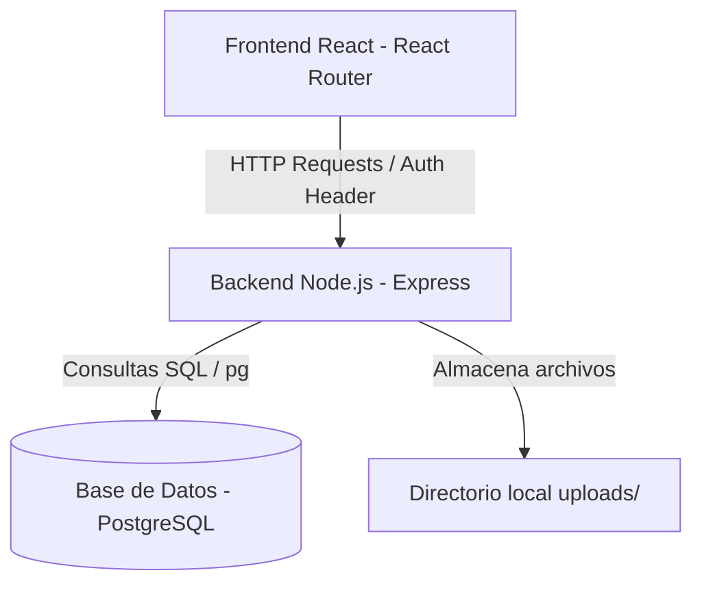

# Especificación Técnica: LocalizaSV - Fase 1

Este documento detalla la especificación técnica de la Fase 1 para el desarrollo de la aplicación web **LocalizaSV**, orientada a la búsqueda y localización de personas desaparecidas en El Salvador.

---

## 1. Resumen Ejecutivo
**LocalizaSV** es una plataforma ciudadana e institucional diseñada para reportar, listar y visualizar casos de personas desaparecidas en El Salvador. La Fase 1 se centra en establecer el sistema de registro de usuarios autenticados con verificación básica (DUI salvadoreño, datos de contacto y selfie) y habilitar la gestión de casos (reportar desapariciones con foto y detalles clave, listar reportes activos y ver el detalle de cada persona desaparecida).

El diseño visual de la aplicación será extremadamente limpio, moderno y empático. Utilizará tonos oscuros elegantes, acentos contrastantes, y un estilo visual premium (glassmorphism, animaciones suaves y tipografía moderna) para proyectar seguridad, seriedad y profesionalismo.

---

## 2. Requisitos Funcionales

### RF-1: Registro de Usuarios
Los usuarios deben poder registrarse en la plataforma ingresando los siguientes datos:
*   **Nombre Completo:** Nombre y apellidos del usuario.
*   **DUI (Documento Único de Identidad):** Validación estricta en formato de El Salvador (`XXXXXXXX-X`), debiendo ser único en el sistema.
*   **Correo Electrónico:** Dirección de correo única y válida.
*   **Teléfono de Contacto:** 8 dígitos (p. ej., `7000-0000`), validando números válidos en el país.
*   **Contraseña:** Mínimo 8 caracteres, encriptada con Hash en la base de datos.
*   **Selfie de Verificación:** Archivo de imagen subido desde el dispositivo para registrar la identidad del usuario reportante.

### RF-2: Autenticación (Login)
*   Acceso al sistema a través de **Correo Electrónico** y **Contraseña**.
*   Generación de un token de seguridad **JWT (JSON Web Token)** con expiración de 24 horas para mantener la sesión activa.
*   Protección de rutas privadas en el frontend y endpoints protegidos en el backend mediante el token.

### RF-3: Gestión de Casos de Desaparición
*   **Crear Caso:** Cualquier usuario autenticado puede registrar un reporte de desaparición ingresando:
    *   Nombre completo de la persona desaparecida.
    *   Edad y Género.
    *   Fecha de desaparición.
    *   Última ubicación conocida (Municipio/Departamento en El Salvador o descripción).
    *   Descripción física detallada (vestimenta, señas particulares).
    *   Teléfono de contacto para recibir información.
    *   Fotografía reciente de la persona desaparecida.
    *   Estado inicial del caso: `Desaparecido`.
*   **Listar Casos (Feed Principal):** Pantalla pública que muestra tarjetas con los casos registrados. Debe incluir:
    *   Búsqueda por nombre de la persona desaparecida.
    *   Filtro por estado (`Desaparecido` / `Encontrado`).
*   **Visualizar Detalle del Caso:** Ficha detallada con la información completa de la persona reportada, foto ampliada, datos de contacto rápidos y la opción de cambiar el estado a `Encontrado` únicamente si el usuario autenticado es el creador del reporte.

---

## 3. Requisitos No Funcionales y Seguridad
*   **Seguridad de Datos:** Las contraseñas se almacenan utilizando `bcryptjs` con un factor de coste de 10 rondas.
*   **Protección de API:** Implementación de cabeceras de seguridad con `helmet` y control de orígenes permitidos con `cors` en el backend de Express.
*   **Validación de Formatos (Regex):**
    *   **DUI:** `/^\d{8}-\d$/` (8 dígitos, guion obligatorio y 1 dígito verificador).
    *   **Teléfono:** `/^[2678]\d{3}-?\d{4}$/` (comienza por 2, 6, 7 u 8, con un total de 8 dígitos y un guion opcional).
*   **Almacenamiento de Archivos:** Las imágenes subidas (selfies de usuario y fotos de personas desaparecidas) se almacenarán localmente en una carpeta pública `uploads/` dentro del servidor backend en la Fase 1. En base de datos se almacenará la ruta relativa o URL para acceso del frontend.
*   **Estética Visual:** Diseño UI premium con tipografía de Google Fonts (p. ej., **Outfit** o **Inter**), animaciones CSS de transición suave, sombras sutiles, micro-interacciones en botones y un tema oscuro/luz unificado de alta fidelidad.

---

## 4. Arquitectura y Stack Tecnológico

La aplicación se construirá con una arquitectura cliente-servidor desacoplada:



### Stack Tecnológico:
*   **Base de Datos:** PostgreSQL 14+.
*   **Backend:** Node.js con Express, utilizando `pg` para la interacción con la base de datos, `jsonwebtoken` para auth, `multer` para la carga de imágenes, y `bcryptjs` para hash de contraseñas.
*   **Frontend:** React (Vite.js) con `react-router-dom` para enrutamiento e interacciones de UI fluidas con Vanilla CSS moderno.

### Estructura de Directorios Propuesta en `app_build/`:

```text
app_build/
├── backend/
│   ├── src/
│   │   ├── config/          # Conexión a Base de Datos (database.js) y variables de entorno
│   │   ├── controllers/     # Controladores (authController.js, caseController.js)
│   │   ├── middlewares/     # Middlewares (authMiddleware.js, uploadMiddleware.js)
│   │   ├── routes/          # Rutas API (authRoutes.js, caseRoutes.js)
│   │   └── app.js           # Archivo de arranque principal de Express
│   ├── uploads/             # Carpeta física para guardar imágenes subidas
│   ├── schema.sql           # Definición de tablas de la BD en PostgreSQL
│   ├── package.json         # Dependencias del Backend
│   └── .env.example         # Plantilla de variables de entorno del servidor
│
├── frontend/
│   ├── src/
│   │   ├── components/      # Componentes comunes (Navbar, Card, Loading)
│   │   ├── pages/           # Vistas (Login, Register, Dashboard, CreateCase, CaseDetail)
│   │   ├── services/        # Cliente API centralizado (api.js)
│   │   ├── index.css        # Hoja de estilo global y variables de diseño CSS
│   │   ├── App.jsx          # Configuración de enrutamiento y estado global
│   │   └── main.jsx         # Punto de entrada de React
│   ├── package.json         # Dependencias del Frontend
│   └── vite.config.js       # Configuración de Vite
```

---

## 5. Modelo de Datos (PostgreSQL)

El archivo `schema.sql` definirá las siguientes tablas:

### Tabla: `usuarios`
Representa las cuentas de los usuarios que reportan casos.
```sql
CREATE TABLE usuarios (
    id SERIAL PRIMARY KEY,
    nombre VARCHAR(255) NOT NULL,
    dui VARCHAR(10) UNIQUE NOT NULL,
    email VARCHAR(255) UNIQUE NOT NULL,
    telefono VARCHAR(15) NOT NULL,
    password_hash VARCHAR(255) NOT NULL,
    selfie_url VARCHAR(512) NOT NULL,
    created_at TIMESTAMP DEFAULT CURRENT_TIMESTAMP
);
```

### Tabla: `casos`
Representa los reportes de personas desaparecidas.
```sql
CREATE TABLE casos (
    id SERIAL PRIMARY KEY,
    usuario_id INT REFERENCES usuarios(id) ON DELETE CASCADE NOT NULL,
    nombre_desaparecido VARCHAR(255) NOT NULL,
    edad INT NOT NULL,
    genero VARCHAR(50) NOT NULL,
    fecha_desaparicion DATE NOT NULL,
    ubicacion_desaparicion VARCHAR(512) NOT NULL,
    descripcion TEXT NOT NULL,
    telefono_contacto VARCHAR(15) NOT NULL,
    estado VARCHAR(50) DEFAULT 'Desaparecido' NOT NULL, -- 'Desaparecido' o 'Encontrado'
    foto_url VARCHAR(512) NOT NULL,
    created_at TIMESTAMP DEFAULT CURRENT_TIMESTAMP
);
```

---

## 6. Endpoints de la API

### Autenticación (`/api/auth`)
*   `POST /api/auth/register`
    *   **Body (multipart/form-data):** `nombre`, `dui`, `email`, `telefono`, `password`, `selfie` (archivo).
    *   **Respuesta (201 Created):** `{ message: "Usuario registrado con éxito" }`.
*   `POST /api/auth/login`
    *   **Body (application/json):** `email`, `password`.
    *   **Respuesta (200 OK):** `{ token: "JWT_TOKEN", usuario: { id, nombre, email } }`.
*   `GET /api/auth/me`
    *   **Headers:** `Authorization: Bearer JWT_TOKEN`.
    *   **Respuesta (200 OK):** Datos del usuario autenticado actual.

### Gestión de Casos (`/api/cases`)
*   `POST /api/cases` (Ruta Protegida)
    *   **Headers:** `Authorization: Bearer JWT_TOKEN`.
    *   **Body (multipart/form-data):** `nombre_desaparecido`, `edad`, `genero`, `fecha_desaparicion`, `ubicacion_desaparicion`, `descripcion`, `telefono_contacto`, `foto` (archivo).
    *   **Respuesta (201 Created):** `{ message: "Caso reportado con éxito", caso: { ... } }`.
*   `GET /api/cases` (Pública)
    *   **Query Params (opcionales):** `search` (búsqueda por nombre), `estado` (Desaparecido/Encontrado).
    *   **Respuesta (200 OK):** Lista de casos que coinciden con los criterios.
*   `GET /api/cases/:id` (Pública)
    *   **Respuesta (200 OK):** Datos completos de un caso específico y los datos básicos del usuario reportante.
*   `PUT /api/cases/:id/estado` (Ruta Protegida - Solo creador del caso)
    *   **Headers:** `Authorization: Bearer JWT_TOKEN`.
    *   **Body (application/json):** `{ estado: "Encontrado" }`.
    *   **Respuesta (200 OK):** `{ message: "Estado de caso actualizado", caso: { ... } }`.

---

## 7. Gestión de Estado y Flujo de Datos en Frontend

1.  **Estado de Autenticación:** Se mantendrá en React un contexto global (`AuthContext`) o estado a nivel de `App.jsx` que lea el JWT de `localStorage` al iniciar.
2.  **Interceptores de Axios:** El archivo `services/api.js` configurará una instancia de `axios` con un interceptor que añade automáticamente el header `Authorization: Bearer <token>` si existe en el almacenamiento local.
3.  **Redirecciones:** Si un usuario no está autenticado, intentar ingresar a `/reportar` lo redirigirá a `/login`. Las páginas públicas `/` y `/caso/:id` son accesibles sin sesión iniciada.
